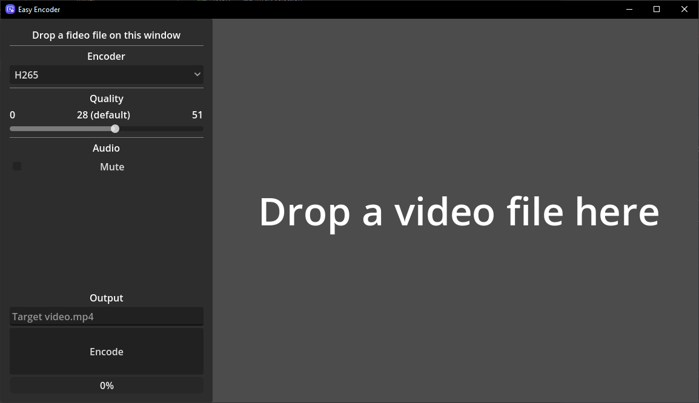
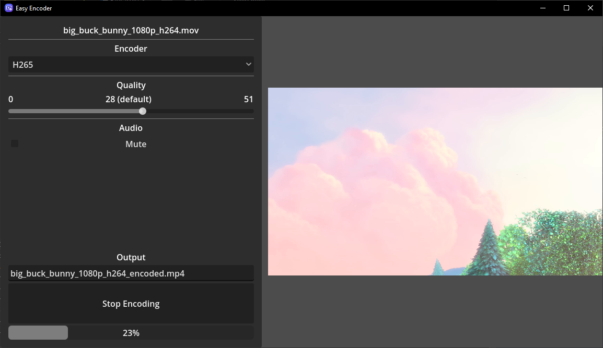

# Easy Encoder

Easy Encoder is a simple, user-friendly front‑end built with the Godot Engine that lets you encode media files without dealing with complex command‑line options.

> Note: This project is my first Godot app, created as a learning exercise. While it works well for basic encoding tasks, it may lack advanced features found in dedicated tools.

---

## Features

- Clean, minimal UI built in Godot
- Adjustable encoding **quality** via slider
- **Mute / unmute** audio toggle
- Preset **encoding options** (Do note that the AV1 encoding is very slow)

---

## Screenshots

  
  

---

## Getting Started

### Using the Windows Build

1. Head over to [the latest build page](https://github.com/Seblor/easy-encoder/releases/latest).
2. Download `Easy Encoder.exe` and place it in a convenient location.
3. Download ffmpeg from [ffmpeg.org](https://ffmpeg.org/download.html) (or directly download it [here](https://github.com/BtbN/FFmpeg-Builds/releases/download/latest/ffmpeg-n8.0-latest-win64-gpl-8.0.zip)) and ensure it's accessible via your system PATH (alternatively you can place `ffmpeg.exe` and `ffprobe.exe` next to `Easy Encoder.exe`).
4. You're ready to run the application!

### Running the Editor Version

1. Install Godot 4.x.
2. Clone or download this repository.
3. Add [ffmpeg](https://ffmpeg.org/) to your system PATH.
4. Open `project.godot` in Godot.
5. Run the project (F5 or ▶ in the Godot editor).

The main scene is `main.tscn`, with the main script in `main.gd`. Supporting scripts live under `src/`.
